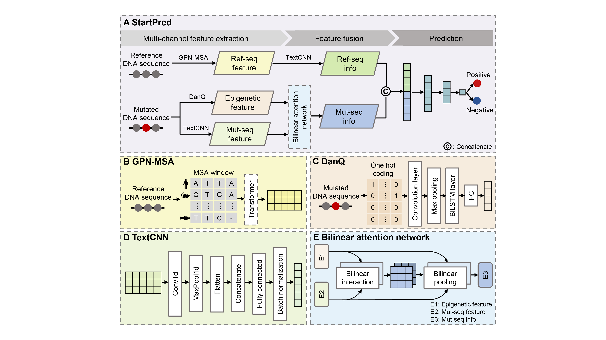

# Prediction of human pathogenic start loss variants based on multi-channel features

StartPred is a prediction method specifically designed to identify pathogenic start loss variants. This method leverages multi-channel features associated with the mutation's contextual sequence, capturing information of evolutionary conservation, nucleotide patterns, and epigenetic modifications. This work lays a foundation for accurately decipher the functional impact of start loss variants in the human genome.


## Precomputed StartPred scores
We have generated StartPred scores for all possible start loss variants in canonical transcripts on human hg38 which can be acessed through https://zenodo.org/records/13689721.

## Basic requirements
To install dependencies, create a new conda environment:
```bash
conda env create -f StartPred.yml
```
We run the program on the Ubuntu 22.04.4 LTS system.

## Additional requirements for model construction

### GPN-MSA
This module is used to quantify the Ref-seq feature about reference sequence.

To install dependencies, create a new conda environment:
```bash
conda env create -f GPN-MSA.yml
```
To download the pre-trained model：
```bash
cd GPNMSA
wget https://huggingface.co/datasets/songlab/multiz100way/resolve/main/89.zarr.zip
cd model
wget https://huggingface.co/songlab/gpn-msa-sapiens/resolve/main/pytorch_model.bin?download=true
```
For more information about GPN-MSA, see https://doi.org/10.1101/2023.10.10.561776 and https://github.com/songlab-cal/gpn.

### DanQ 
This module is used to quantify the epigenetic feature about mutated sequence.

To install dependencies, create a new conda environment:
```bash
conda env create -f DanQ.yml
```
For more information about DanQ, see https://doi.org/10.1093/nar/gkw226 and http://github.com/uci-cbcl/DanQ.

## Quick start

### Input format
StartPred supports variants in CSV format as input. The input file should contain at least 7 columns in the header as follows. [Sample file](./data/test.csv)

|  Chr  | Pos |  Ref  |  Alt  |  Label  |  Reference sequence  |  Mutated sequence  |  ...  |
| ----- | --- | ----- | ----- | ------- | -------------------- | ------------------ | ----- |

Please note that the length of both the reference and mutated sequences are 1001 base pairs(bp), with the mutation site at the center, and the context sequences on each side are 500 bp.

### Quantify the Ref-seq feature based on GPN-MSA
```bash
conda activate GPN-MSA
cd GPNMSA
python GPN-MSA_feature_prepare.py
```
In this section, the example output file titled 'test_GPN-MSA_feature.pth' is available for download at https://zenodo.org/records/13689721.

### Quantify the epigenetic feature based on DanQ
```bash
conda activate DanQ
cd DanQ
python Fasta_data_prepare.py
python DanQ_feature_prepare.py
```
Please note that input files (.fasta) for 'DanQ_feature_prepare.py' must not contain any blank lines.

In this section, the example output file titled 'test_DanQ_features.h5' is available for download at https://zenodo.org/records/13689721.

### Pathogenicity prediction
```bash
conda activate StartPred
cd StartPred
python main.py
```

### Output format
This program produces two output files.

The first file is 'sta_test.csv' [Sample file](./result/sta_test.csv). It provides a comprehensive overview of StartPred's predictive performance on the dataset, encompassing various metrics such as recall, specificity (SPE), precision (PRE), F1-score (F1), Matthew's correlation coefficient (MCC), accuracy (ACC), the area under the receiver operating characteristic curve (AUC), and the area under the precision-recall curve (AUPR).

The second file is 'test_pred_score.txt' [Sample file](./result/test_pred_score.txt). It contains a list of scores assigned by StartPred to each variant in the dataset, with the sample order matching that of the input data in 'data/test.csv'. The scoring threshold for StartPred is established at 0.5, whereby variants scoring below 0.5 are designated as benign and those scoring above 0.5 are identified as pathogenic.

## Cite us
```
@misc{
      title={Prediction of human pathogenic start loss variants based on multi-channel features}, 
      author={Jie Liu and Lihua Wang and Yansen Su and Bin Ye and Junfeng Xia},
      year={2024}
}
```

